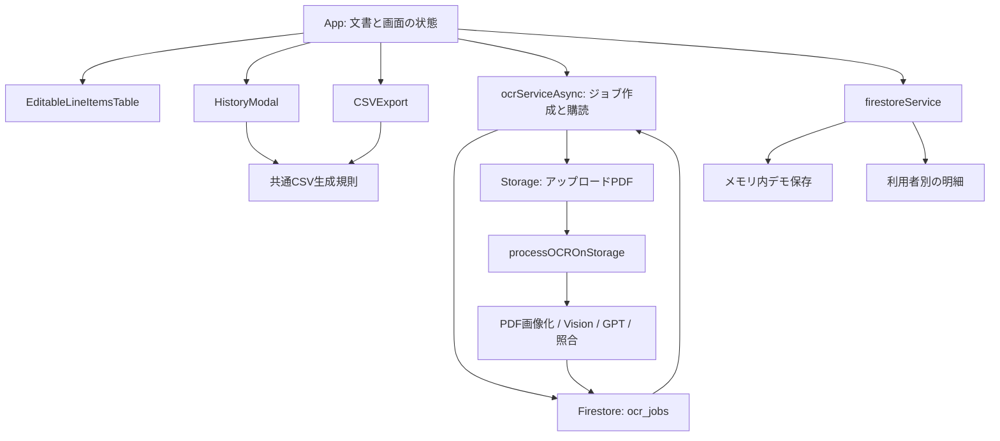

# 請求書自動化 — Invoice Automation

[English](README.md) · [日本語](README.ja.md)

日本語の請求書PDFから確認可能な明細を作り、仕入伝票／売上伝票用の40列CSVへ変換するアプリケーションです。Reactの編集画面、Firebaseの非同期ジョブ、Google Cloud Vision OCR、OpenAIによるJSON構造化、仕入先名の照合、Shift-JIS出力を収録しています。

このパッケージは公開参照用に情報を整理したソースです。会社、船舶、商品、コード、サンプル値はすべて架空です。元のGit履歴、顧客記録、運用マスタ、実際の請求書、デプロイ識別子、認証情報は含みません。初期設定は**合成データを使うオフラインデモ**です。クラウド処理の実装も含みますが、利用には明示的な構成と有効化が必要です。

## 対象とする作業

1. 請求書を文書単位で登録します。
2. クラウドモードではPDFをページ画像にし、OCRで文字を抽出します。
3. LLMで仕入先、船舶、明細のJSONへ整理します。
4. 仕入先名の表記を正規化し、サンプルのコード対応を適用して編集可能な行に変換します。
5. 担当者がPDFと比較して抽出結果を修正します。
6. 同じ確認済み明細から仕入CSVと売上CSVを生成します。

自動化の範囲は**人が確認できる抽出明細の作成**です。OCRが常に正しいと仮定したり、会計システム内の伝票を自動承認したりするものではありません。

## 二つの実行モード

| 項目 | 初期設定のデモ | 任意で構成するクラウド |
|---|---|---|
| 入力 | コードで生成する合成PDFと用意済み明細 | ログインした利用者が選択したPDF |
| OCR | 呼び出しなし | Google Cloud VisionとOpenAI |
| ログイン | 不要 | Firebase Email/Password認証 |
| 明細保存 | ブラウザのメモリ | `users/{uid}/lineItems/{id}` |
| PDF保存 | セッション内の`File` | Storage `uploads/{jobId}/{filename}` |
| 履歴 | 再読み込みで消える | アカウントに属するFirestore記録 |
| 設定 | 初期値で動作 | フロント設定、サーバー有効化、アクセス制御 |

デモでは認証情報なしで、編集、合計、CSV出力、PDF表示、履歴を確認できます。明細は用意済みの例であり、**OCRの実測結果ではありません**。デモで任意のPDFを選択しても、オフラインOCRを実行したり、架空の抽出結果を返したりしません。

## すぐに起動する

**Node.js 22.13以上**とnpmを用意し、パッケージのルートで実行します。

```sh
npm ci --ignore-scripts
npm run dev -- --host 127.0.0.1
```

Viteが表示するローカルURLを開き、`サンプル2件を読み込む`を選択します。デモにはFirebaseプロジェクト、OpenAIキー、アカウントが不要です。依存パッケージの取得にはネットワークを使いますが、サンプル処理はブラウザ内で完結します。デモの起動に`functions/`側の依存関係をインストールする必要はありません。

一つのサンプルは意図的に数量を未確定にしています。合成PDFを確認して`2`を入力するとCSV出力が可能になります。編集内容とデモ履歴はページの再読み込みで消えます。

クラウドモードを選ぶのは、`VITE_DEMO_MODE=false`を正確に指定した場合だけです。サーバーでは別途`CLOUD_PROCESSING_ENABLED=true`が必要です。構成前に[セットアップ](docs/ja/setup.md)と[制約](docs/ja/limitations.md)を確認してください。

## 全体の構成



画面の接続関係は`src/App.tsx`、非同期処理は`ocrServiceAsync.ts`と`functions/src/index.ts`、明細への変換は`lineItemConverter.ts`、最終出力の規則は`csvExport.ts`から読むと理解しやすくなります。

| 領域 | 主なファイル | 責務 |
|---|---|---|
| UIと状態 | `src/App.tsx`, `src/components/` | 文書、編集、PDF表示、履歴、認証UI |
| デモと操作セッション | `src/demo/` | 合成PDF・明細、メモリ保存、操作開始者の固定 |
| クライアントサービス | `src/services/ocrServiceAsync.ts`, `firestoreService.ts` | OCR依頼、結果購読、所有者別CRUD |
| CSV | `src/utils/csvExport.ts`, `*CodeMapping.ts` | 40列、合成価格規則、引用符、文字コード |
| OCRバックエンド | `functions/src/index.ts`, `functions/src/services/` | 認証、所有者検査、画像化、OCR、構造化、変換 |
| アクセス規則 | `firestore.rules`, `storage.rules` | 利用者、ジョブ、ファイル、明細の境界 |

以前のHTTP OCRや照合実験のコードも参照用として残しています。ファイルが存在することと、現在のUIから使われることは別です。[コードマップ](docs/ja/code-map.md)では、稼働経路と参照経路、旧HTTPクライアントを再利用する際に必要な接続修正を区別しています。

## 設計上の判断

**ファイルイベントからOCRを開始します。** ブラウザはジョブを作り、PDFをアップロードし、Firestoreの状態変更を購読します。全処理を一つの長いHTTP応答待ちにまとめません。現在のクライアント待機は5分、関数の実行上限は9分です。クライアントのタイムアウトはサーバーの処理中止を意味しません。

**OCR結果と編集対象を分離します。** `ocr_jobs`は状態と初回結果の受け渡し、`users/{uid}/lineItems`は確認・修正した明細の保存を担います。行を編集してもOCR結果を書き換えたり、抽出を再実行したりしません。

**文書と行の識別子を保持します。** `sourceDocumentId`で元のPDF、`id`で編集・削除対象の行を特定します。複数PDFの行を一つの表に表示しても、同じ明細をすべての文書へ複製しません。クラウド操作は開始時の利用者セッションを固定し、アカウント変更後に届いた結果を拒否します。

**CSV計算を一か所にまとめます。** メイン画面と履歴は同じhelperを使います。選択した行の集合によって掛率判定の合計は変わりますが、列配置と丸め規則は共通です。

**サービスの秘密情報をブラウザに置きません。** 稼働中のOCR経路でOpenAIキーを使うのはサーバーだけです。`VITE_`変数は生成したクライアントから確認できるため、サービスの秘密情報を保存する場所ではありません。設定画面にもAIキーの収集・保存機能はありません。

## CSVと金額の取り扱い

- 仕入・売上ともにA〜ANの40列、ヘッダーなし、CRLF、Shift-JISです。
- すべてのフィールドをダブルクォートで囲み、内部のクォートを二重化します。
- 商品名と最後の名称欄を半角カタカナへ変換します。
- **架空のデモ規則**として、出力対象の仕入金額合計が`100,000`未満なら売上倍率`1.10`、以上なら`1.05`を適用します。顧客の実際の取引条件を表す値ではありません。
- 各行で`売上単価 = Math.round(仕入単価 × 倍率)`、`売上金額 = 丸めた売上単価 × 数量`を計算します。合計に一度だけ倍率を掛けて丸めた結果とは異なる場合があります。
- 未確定数量、空の商品名・日付、有限値でない数値があると出力を止めます。ゼロや有限の負数は自動的には拒否しません。
- 税額は独立して計算しません。会計上の区分を示す一部の列には固定値を出力します。

対応表と固定値は、この実装の出力規則を示しています。公式認定や、弥生販売のすべての版・設定への対応を表すものではありません。取込先の形式と[全40列の仕様](docs/ja/csv-specification.md)を照合してください。一括出力と文書単位の出力では対象合計が異なり、倍率が変わる場合があります。

## 技術と役割

| 技術 | 役割 |
|---|---|
| React 18、TypeScript、Vite | 単一ページUI、型検査、開発・production bundle |
| Firebase Auth | クラウドのログインとID token |
| Firestore | ジョブ状態、利用者別明細、仕入先名マスタ |
| Firebase Storage | 非公開PDFオブジェクトとfinalizeイベント |
| Firebase Functions、Node 22設定 | サーバー処理と補助HTTP API |
| PDF.js、`@napi-rs/canvas` | ブラウザ内のPDF表示とサーバー側の画像化 |
| Google Cloud Vision | 画像から日本語・英語テキストを抽出 |
| OpenAI Chat Completions | OCRテキストを請求書JSONへ構造化 |
| `encoding-japanese` | CSVのShift-JISエンコード |
| Vitest、Node test runner | 合成入力による再現可能な確認 |

## 詳細資料

英語版と日本語版は、同じ実装、データ規則、サンプル、検証根拠、制約を説明しています。

| 内容 | 日本語 | English |
|---|---|---|
| システムの層とデータフロー | [構成とデータフロー](docs/ja/architecture.md) | [Architecture](docs/architecture.md) |
| ファイル・シンボル別の責務 | [コードマップ](docs/ja/code-map.md) | [Code map](docs/code-map.md) |
| フィールド、ID、所有者、保管 | [データモデル](docs/ja/data-model.md) | [Data model](docs/data-model.md) |
| 抽出、照合、正規化 | [OCR処理](docs/ja/ocr-pipeline.md) | [OCR pipeline](docs/ocr-pipeline.md) |
| CSV全40列と計算 | [CSV仕様](docs/ja/csv-specification.md) | [CSV specification](docs/csv-specification.md) |
| デモとクラウドの構成 | [セットアップ](docs/ja/setup.md) | [Setup](docs/setup.md) |
| 未完成・未検証の範囲 | [制約](docs/ja/limitations.md) | [Limitations](docs/limitations.md) |
| 実際に行った確認 | [検証記録](docs/ja/verification.md) | [Verification record](docs/verification.md) |
| 含めた内容と除外項目 | [公開範囲](docs/ja/publication-scope.md) | [Publication scope](docs/publication-scope.md) |

## 検証と公開状態

コマンドは[CHECKS.ja.md](CHECKS.ja.md)、実施した範囲は[検証記録](docs/ja/verification.md)を参照してください。記録された確認には、26件のテスト、ローカルPDF描画、独立したアクセス規則emulatorが含まれます。実際のVision／OpenAI呼び出し、デプロイ済みIAM、会計ソフトimport、効率改善率の実測を示すものではありません。

記録時点のフロントエンド依存関係監査は検出0件です。バックエンドには一つのupstream uuid advisoryに由来するmoderateのパッケージ警告2件が残り、high／criticalは0件です。CSVの変換テストは通過しましたが、ブラウザのdownloadイベント捕捉では完了を確認できませんでした。これらの制約は両言語版に残しています。

コード・商品対応の一部は合成サンプル用実装であり、完全なマスタ連携や汎用の会計エンジンではありません。ソース公開と本番運用は別々に判断する必要があります。

**2026-09-17にソース公開が承認されました。** このリポジトリは、記載した実装と合成デモを確認するためのものです。公開によってサービスがデプロイされたり、新しいオープンソースライセンスが付与されたりすることはありません。[LICENSE-NOTICE.ja.md](LICENSE-NOTICE.ja.md)を参照してください。
