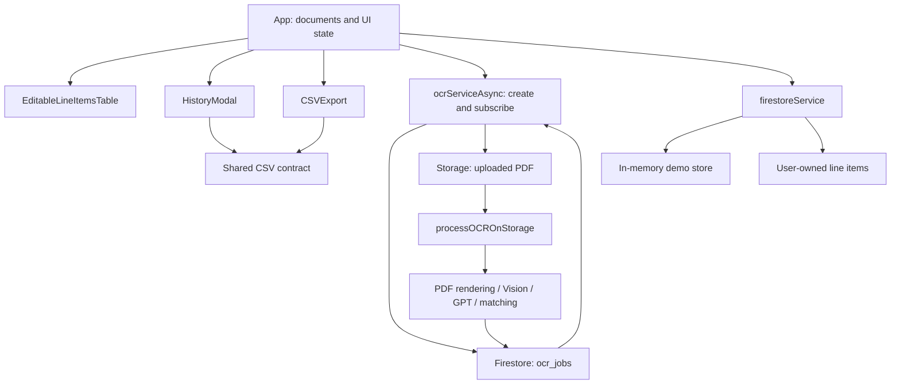

# Invoice Automation

[English](README.md) · [日本語](README.ja.md)

A Japanese invoice workflow that turns PDF documents into reviewable line items and then into 40-column purchase and sales CSV files. The package includes a React editing interface, asynchronous Firebase jobs, Google Cloud Vision OCR, OpenAI JSON structuring, supplier-name matching, and Shift-JIS export.

This is a sanitized source package for public reference. It contains invented companies, vessels, products, codes, and example values. Original Git history, customer records, operational master data, real invoices, deployment identifiers, and credentials are excluded. The default mode is an **offline synthetic demo**; the cloud processing implementation is included but must be configured and enabled explicitly.

## What the workflow does

1. Register each invoice as a separate source document.
2. In cloud mode, render PDF pages as images and extract text with OCR.
3. Structure that text into supplier, vessel, and item JSON using an LLM.
4. Normalize supplier names, apply example code mappings, and produce editable rows.
5. Let a person compare the rows with the PDF and correct the result.
6. Generate purchase CSV and sales CSV using the same reviewed items.

The automation boundary is a set of **reviewable extracted rows**. It does not assume that OCR is always correct or automatically approve vouchers in an accounting system.

## Two execution modes

| Area | Default demo | Optional cloud mode |
|---|---|---|
| Input | Generated synthetic PDFs and predefined sample rows | PDFs selected by the signed-in user |
| OCR | Not called | Google Cloud Vision and OpenAI |
| Sign-in | Not required | Firebase Email/Password authentication |
| Row storage | Browser memory | `users/{uid}/lineItems/{id}` |
| PDF storage | Session-local `File` objects | Storage `uploads/{jobId}/{filename}` |
| History | Cleared on page reload | Firestore records belonging to the account |
| Configuration | Defaults | Frontend configuration, server activation, and access controls |

The demo lets a reviewer inspect editing, totals, CSV output, PDF preview, and history without credentials. Its rows are prepared examples, **not measured OCR output**. Selecting an arbitrary PDF in demo mode does not run offline OCR or invent extracted results.

## Quick start

Use **Node.js 22.13 or later** and npm. From the package root:

```sh
npm ci --ignore-scripts
npm run dev -- --host 127.0.0.1
```

Open the local URL printed by Vite and select `サンプル2件を読み込む` (load two samples). The demo needs no Firebase project, OpenAI key, or account. Dependency installation needs network access, but sample processing stays within the browser. The separate `functions/` dependencies are not required to run the demo.

One sample deliberately has an unknown quantity. Check its synthetic PDF and enter `2` to enable export. Changes and demo history disappear on reload.

Only the exact value `VITE_DEMO_MODE=false` selects cloud mode. The server separately requires `CLOUD_PROCESSING_ENABLED=true`. Read [setup](docs/setup.md) and [limitations](docs/limitations.md) before configuring either.

## How the application is organized



Start with `src/App.tsx` for the interface connections, `ocrServiceAsync.ts` and `functions/src/index.ts` for job processing, `lineItemConverter.ts` for domain conversion, and `csvExport.ts` for the final output contract.

| Area | Main files | Responsibility |
|---|---|---|
| UI and state | `src/App.tsx`, `src/components/` | Documents, editing, PDF preview, history, authentication UI |
| Demo and operation sessions | `src/demo/` | Invented PDFs and rows, memory storage, operation-owner guards |
| Client services | `src/services/ocrServiceAsync.ts`, `firestoreService.ts` | OCR requests, result subscriptions, owner-scoped CRUD |
| CSV | `src/utils/csvExport.ts`, `*CodeMapping.ts` | Forty columns, example pricing, quoting, character encoding |
| OCR backend | `functions/src/index.ts`, `functions/src/services/` | Authentication, ownership, rendering, OCR, structuring, conversion |
| Access rules | `firestore.rules`, `storage.rules` | Boundaries between users, jobs, files, and rows |

Earlier HTTP OCR and matching experiments remain as reference code. Their presence does not mean that the current UI uses them. The [code map](docs/code-map.md) distinguishes active and reference paths, including the additional integration work required to reuse legacy HTTP clients.

## Design decisions

**Start OCR from a file event.** The browser creates a job, uploads the PDF, and subscribes to Firestore status changes. It does not hold one long HTTP request for the whole job. The current client waits five minutes while the function may run for nine; a client timeout is not server cancellation.

**Separate OCR results from editable records.** `ocr_jobs` transports status and initial results. `users/{uid}/lineItems` stores reviewed rows. Editing a row does not rewrite the OCR result or rerun extraction.

**Retain document and row identity.** `sourceDocumentId` identifies the source PDF, and `id` identifies the edited or deleted row. Combining several PDFs in one table does not copy the same rows into every document. Cloud operations pin the initiating user session and reject later results if the account changes.

**Keep CSV calculation in one place.** The current view and history use the same helper. The selected row set can change the pricing threshold total, but column placement and rounding rules are shared.

**Keep service secrets out of the browser.** The active OCR path uses the OpenAI key only on the server. `VITE_` variables are visible in the built client and are not a place for service secrets. The settings screen does not collect or store AI keys.

## CSV and amounts

- Both exports have 40 columns, A–AN, no header, CRLF line endings, and Shift-JIS encoding.
- Every field is double-quoted; embedded quotes are doubled.
- Product names and the final name column are converted to half-width katakana.
- The **invented demo policy** uses a sales multiplier of `1.10` when the selected purchase total is below `100,000`, or `1.05` otherwise. These values do not describe a customer's commercial terms.
- Each sales unit price is `Math.round(purchaseUnitPrice × multiplier)`; each sales amount is that rounded price multiplied by quantity. Rounding one grand total can produce a different result.
- Unknown quantity, blank item name/date, and non-finite numbers block export. Zero and finite negative values are not automatically rejected.
- Tax amounts are not calculated separately. Several accounting classification columns use fixed values.

The mappings and fixed values define this implementation's contract. They are not official certification or a claim of compatibility with every version or configuration of Yayoi Sales. Confirm the destination format against the [complete 40-column specification](docs/csv-specification.md). Batch export and a single document's export can select different multipliers because their input totals differ.

## Technology and responsibility

| Technology | Role |
|---|---|
| React 18, TypeScript, Vite | Single-page interface, type checks, development and production bundles |
| Firebase Auth | Cloud sign-in and ID tokens |
| Firestore | Job status, user-owned rows, supplier-name master |
| Firebase Storage | Private PDF objects and finalize events |
| Firebase Functions, configured for Node 22 | Server processing and supporting HTTP APIs |
| PDF.js, `@napi-rs/canvas` | Local browser preview and server-side PDF image rendering |
| Google Cloud Vision | Japanese and English text extraction from images |
| OpenAI Chat Completions | Structuring OCR text into invoice JSON |
| `encoding-japanese` | Shift-JIS CSV encoding |
| Vitest and Node test runner | Repeatable checks using synthetic inputs |

## Detailed documentation

English and Japanese editions cover the same implementation, data contracts, examples, verification evidence, and limitations.

| Topic | English | 日本語 |
|---|---|---|
| System layers and data flow | [Architecture](docs/architecture.md) | [構成とデータフロー](docs/ja/architecture.md) |
| File and symbol responsibilities | [Code map](docs/code-map.md) | [コードマップ](docs/ja/code-map.md) |
| Fields, IDs, ownership, retention | [Data model](docs/data-model.md) | [データモデル](docs/ja/data-model.md) |
| Extraction, matching, normalization | [OCR pipeline](docs/ocr-pipeline.md) | [OCR処理](docs/ja/ocr-pipeline.md) |
| All 40 CSV columns and calculations | [CSV specification](docs/csv-specification.md) | [CSV仕様](docs/ja/csv-specification.md) |
| Demo and cloud configuration | [Setup](docs/setup.md) | [セットアップ](docs/ja/setup.md) |
| Incomplete and unverified behavior | [Limitations](docs/limitations.md) | [制約](docs/ja/limitations.md) |
| Checks actually performed | [Verification record](docs/verification.md) | [検証記録](docs/ja/verification.md) |
| Included and excluded material | [Publication scope](docs/publication-scope.md) | [公開範囲](docs/ja/publication-scope.md) |

## Verification and publication status

See [CHECKS.md](CHECKS.md) for commands and the [verification record](docs/verification.md) for their actual scope. The recorded checks include 26 tests, local PDF rendering, and isolated access-rule emulators. They do not establish live Vision/OpenAI success, deployed IAM correctness, accounting import compatibility, or measured efficiency gains.

The recorded frontend dependency audit has no findings; the backend has two moderate package warnings linked to one upstream uuid advisory, with no high or critical findings. Browser download-event capture was inconclusive even though serialization tests passed. These limits are retained in both language editions.

Some code and product mappings are examples, not a complete master-data integration or general accounting engine. Source publication and production deployment are separate decisions.

**Source publication was authorized on 2026-09-17.** This repository is for reviewing the documented implementation and synthetic demo. Publication does not deploy a service or grant a new open-source license. See [LICENSE-NOTICE.md](LICENSE-NOTICE.md).
