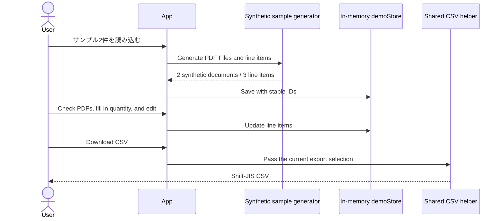
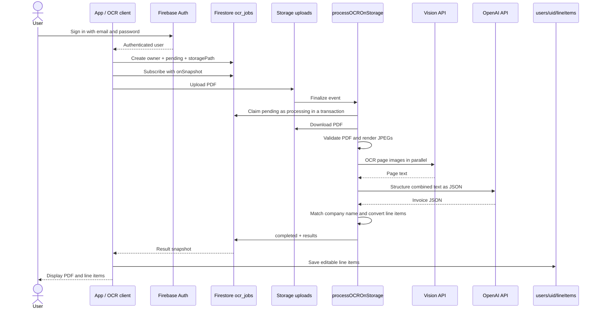

# System Architecture

[日本語](ja/architecture.md) · [README](../README.md)

This document explains the paths used by the current UI and the storage boundaries in the public-review source package. See the [data model](data-model.md) for individual fields and the [code map](code-map.md) for file responsibilities.

## 1. Layers and Responsibilities

| Layer | Responsibility | Outside its direct responsibility |
|---|---|---|
| React UI | PDF list, line-item editing, source preview, history, downloads | OCR model calls and secret management |
| Frontend services | Runtime mode selection, owner-scoped line-item CRUD, job creation and subscriptions | Vision and OpenAI service credentials |
| Firestore job documents | Communicating server progress and results | Subsequent user edits |
| Storage objects | Retaining uploaded PDFs and triggering processing | The line-item database |
| Cloud Function | Authentication and ownership checks, PDF rendering, OCR, JSON structuring, conversion | The browser's table-editing state |
| Shared CSV helper | Input validation, totals and markups, 40-column layout, character encoding | Finalizing accounting entries or importing into accounting software |

The frontend is a single-screen UI whose state is managed by `App.tsx`. Source PDFs are rendered from browser File objects to a local PDF.js canvas. Users can move between pages, and loading/rendering tasks are terminated when the file changes or the view is cleaned up. The active UI has no separate server-rendering or page-routing layer.

## 2. Default Demo Flow

The demo generates fixed line items and synthetic text PDFs. One row deliberately has no quantity, allowing the user to review the source and enter the missing value. Arbitrary PDF uploads are not presented as actual OCR results. `demoStore` is an in-memory browser Map, not persistent storage that survives a refresh.

## 3. Cloud OCR Flow

In this flow, the PDF is sent to Google Cloud Storage and Vision, and the OCR text is sent to OpenAI. The default demo does not perform these external transfers.

## 4. Authentication and Ownership Boundaries

- The client uses `requireCloudUser()` to block cloud operations in demo mode, with missing configuration, or without a signed-in user.
- A job creator puts their own UID in `userId`. Reads are limited to the job owner, and clients cannot modify server-managed status or results.
- The uploaded object at `uploads/{jobId}/invoice.pdf` must match the job document's `storagePath` and `fileName`. An upload alone does not authorize arbitrary processing.
- The server uses a transaction to change only `pending` jobs to `processing`. If the same object event is redelivered while the job is already processing or completed, it does not start another OCR call.
- Asynchronous line-item operations capture the authenticated user object and UID at the start. If the account changes, they stop applying results and making subsequent writes. Editable line items are stored under `users/{uid}/lineItems/{id}`. Both frontend path construction and Firestore rules separate owners.
- Auxiliary HTTP APIs verify a Firebase Bearer ID token. PDF URL generation checks ownership of the requested file as well as authentication.

These are access boundaries implemented in the source. Production IAM, deployed rules, and service-account permissions require separate verification. CORS configuration does not replace authentication.

## 5. Lifetimes of Results and Editable Data

| Data | Storage location | Lifetime / deletion behavior |
|---|---|---|
| Demo line items and PDFs | Browser memory | Lost on refresh |
| Current document list | React state | Current application session |
| OCR job status and original results | `ocr_jobs/{jobId}` | No automatic TTL or cleanup job |
| Uploaded PDFs | Storage uploads path | Not automatically deleted when line items are deleted |
| Editable cloud line items | `users/{uid}/lineItems/{id}` | Explicit row/document deletion |
| Company-name master | `companies/{id}` | Managed separately by the operator |
| Company-master cache | Function-instance memory | Up to one hour, separately per instance |
| CSV | User's downloaded file | Remains as a file outside the app |

Saving line items does not automatically delete older rows. A retention policy and object-cleanup functionality are not included as complete operational features in this package.

## 6. UI Editing and Synchronization

Line items belong to a document through `sourceDocumentId`, and each row is identified by `id`. The main screen can display rows from multiple documents together, then redistributes them by document after edits. When authentication changes, App increments a generation counter to prevent late status updates or results from an earlier operation from appearing in the new account's UI. This is not a transaction that rolls back writes already completed under the previous account. Row additions, updates, and deletions are applied to storage before synchronizing the UI. History uses the same line-item service.

The amount fields are not an automatic accounting worksheet. Initial server conversion includes quantity × unit-price correction, but there is no general rules engine that recalculates every related field and tax amount when users edit cells. Before exporting CSV, check the source, quantity, unit price, amount, and counterparty together.

The main screen's combined CSV export receives all line items currently displayed. A document-specific history export receives only that document. Even with the same helper, a different input scope changes the total used to choose the demo markup.

## 7. Failure Boundaries

- Multiple PDFs are processed sequentially. Errors are handled per document so other documents can still be processed.
- An OCR failure is not converted into a normal line item with a zero amount. Errors are shown separately from line-item data.
- The client's five-minute timeout ends the subscription but does not cancel the server job. The function's maximum runtime is 540 seconds.
- If the server stops after the transaction claim, a job may remain in processing. There is no automatic lease expiry, retry queue, or administrator recovery UI.
- Saving or updating multiple line items does not wrap the entire accounting document in one transaction. Compensation and recovery from partial success need further review before operation.

## 8. Current and Legacy Paths

The current App uses the Storage-trigger-based `ocrServiceAsync`. The HTTP-based OCR in `ocrService.ts`, fuzzy-matching research modules, quality logging, and consistency comparison remain as reference code. They must not all be described as mandatory stages of the current OCR pipeline.

Server HTTP functions are exported regardless of whether App uses them. Before deployment, review the actual exports together with the Hosting rewrites. Their connections are documented in the [code map](code-map.md).
