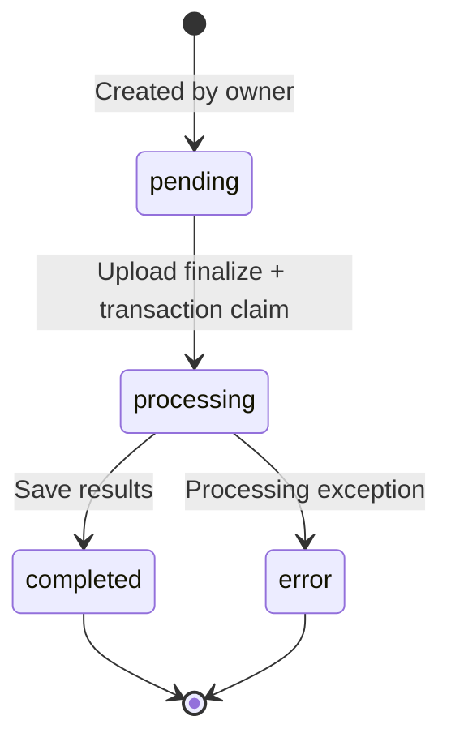

# Data Model and Storage Contract

[日本語](ja/data-model.md) · [README](../README.md)

The frontend types are defined in `src/types/index.ts`, the server extraction types in `functions/src/services/gptService.ts`, and the conversion output in `lineItemConverter.ts`. Source types and Firestore rules validate different things, so read them together.

## 1. The `LineItem` Record

| Field | Frontend type | Meaning and origin |
|---|---|---|
| `id` | string | Row identifier. Initial cloud results use `jobId-index`; new manual rows receive separate IDs |
| `sourceDocumentId` | string? | Owning PDF/job identifier. Reprocessing a file with the same name still creates a distinct document |
| `仕入日` | string | Invoice/purchase date; passed to CSV column D |
| `伝票番号` | string | Voucher number for display. The server returns an empty value rather than treating a row index as a voucher number |
| `仕入先コード` | string | Supplier code; the server uses a synthetic lookup |
| `仕入先名` | string | Supplier name, retained after name normalization |
| `得意先コード` | string? | Vessel/customer code |
| `得意先名` | string? | Vessel/customer name |
| `商品コード` | string | Server product-lookup result or sample code |
| `商品名` | string | Product name, including part numbers |
| `数量` | number or null | null indicates an unclear quantity for the user to check |
| `単価` | number | Unit price; a null server extraction value becomes 0 during conversion |
| `金額` | number | Line amount after server correction; null becomes 0 |
| `課税区分` | string | Tax classification for display; the current CSV does not output this string directly |
| `摘要` | string? | Description such as the machine model from the header |
| `pdfFileName` | string? | Original filename for display, distinct from the safe filename used in server paths |
| `pdfFile` | File? | Source file in the browser session; excluded from Firestore serialization |
| `pdfUrl` | string? | Compatibility with older data; current server results do not create permanent public URLs |
| `pdfStoragePath` | string? | Internal bucket path such as `uploads/.../...pdf`, not a URL |
| `createdAt` | any? | Firestore Timestamp or demo save time |

The server's `ServerLineItem` also returns `備考: string`, containing an item's `摘要` or `型式番号`. This field is not declared in the frontend `LineItem` interface. Object spreading may retain it, but it must not be treated as part of the standard editing or CSV contract.

The shared CSV helper applies synthetic name-based mappings instead of directly using `商品コード`, `得意先コード`, or `仕入先コード`. Do not assume that editing a code field directly changes CSV columns K/P. The field sources in the [CSV specification](csv-specification.md) are authoritative.

## 2. Synthetic Line-Item Example

```json
{
  "id": "demo-document-a-0",
  "sourceDocumentId": "demo-document-a",
  "仕入日": "2026-01-15",
  "伝票番号": "DEMO-001",
  "仕入先コード": "201",
  "仕入先名": "サンプル部品株式会社",
  "得意先コード": "101",
  "得意先名": "サンプル一号",
  "商品コード": "D1",
  "商品名": "デモ用フィルター A-100",
  "数量": 2,
  "単価": 1200,
  "金額": 2400,
  "課税区分": "課税10.0%",
  "摘要": "架空データ / 型式 DEMO-A",
  "pdfFileName": "demo-invoice-001.pdf"
}
```

`pdfFile` and Timestamp are omitted from this JSON example. The display string `課税10.0%` does not mean that the app calculates and stores a 10% tax amount for that row.

## 3. The UI's `PDFDocument`

```ts
interface PDFDocument {
  id: string
  file: File
  uploadedAt: Date
  lineItems: LineItem[]
  status: 'uploaded' | 'processing' | 'completed' | 'error'
}
```

This document type represents UI state. The complete object is not stored in Firestore. Files reside in Storage or demo memory, line items in a user subcollection, and OCR processing status in a job. The history view reconstructs its document list from the document identifiers on the line items.

## 4. OCR Jobs: `ocr_jobs/{jobId}`

Clients may create only the following five fields.

| Field | Value / condition |
|---|---|
| `status` | Exactly `pending` |
| `fileName` | Safe PDF filename for the server |
| `storagePath` | Exactly `uploads/{jobId}/{fileName}` |
| `userId` | Currently authenticated user's UID |
| `createdAt` | `serverTimestamp()`; rules require it to equal the request time |

Fields added by the server:

| Field | Meaning |
|---|---|
| `status` | `processing`, `completed`, or `error` |
| `message` | Progress stage such as downloading, conversion, OCR, or structuring |
| `updatedAt` | Server update time |
| `objectGeneration` | Claimed Storage-object generation; the download uses the same generation |
| `results` | `ServerLineItem[]` on completion |
| `error` | Generalized error message to show the user on failure |



Clients cannot update or delete jobs. A new upload after an error is processed as a new job. No separate recovery transition, lease, or TTL is implemented for jobs that remain pending or processing for too long.

Filenames must begin with an ASCII letter or digit, continue with letters, digits, dots, underscores, or hyphens, and end with a PDF extension. Consecutive `..` is forbidden. Client-side path-name generation and rule validation must agree; the current client uses the fixed object name `invoice.pdf`. The original Japanese filename is retained separately as line-item display metadata.

## 5. LLM Intermediate Structure: `StructuredInvoice`

```ts
interface StructuredInvoice {
  仕入先名: string
  仕入先コード?: string
  仕入日: string
  機械型式?: string
  document_subtotal?: number | null
  ships: Array<{
    ship_name: string | null
    items: Array<{
      商品名: string
      数量: number | null
      単価: number | null
      金額: number | null
      摘要?: string | null
      型式番号?: string | null
    }>
  }>
}
```

`validateStructuredInvoice` checks required header strings, the vessel array, item product names, numbers/nulls, and optional description strings, and limits the total item count to 1,000. The API uses JSON mode, not a Structured Outputs configuration that sends a strict JSON schema.

The validator does not check every business rule. It does not guarantee calendar-valid dates, quantities or unit prices matching the invoice, registered supplier codes, or agreement between document and line-item totals. `document_subtotal` exists in the extraction type but is not used for subsequent total validation.

## 6. Persistence and Serialization

`firestoreService` reads and writes only line items under the signed-in UID. New saves preserve the supplied ID, or generate a UUID if none is provided. Because `id` is the document ID, it is removed from the serialized body, along with `pdfFile` and undefined fields. `createdAt` and `updatedAt` use the client's `Timestamp.now()`.

Current line-item rules enforce user ownership but do not validate each field's schema or financial calculations. Client-editable data must not be treated as a server-finalized accounting ledger.

Saving does not automatically remove older rows. Multi-row saves are sequential requests, not one transaction. Resubmitting the same PDF as a new job can save it as a new document. There is no file-content-hash-based duplicate detection.

## 7. Company Master and Code Lists

Name-matching fields in a `companies/{id}` document:

```json
{
  "name": "サンプル部品株式会社",
  "variants": ["サンプル部品", "Sample Parts Co."]
}
```

This is a synthetic example to be inserted through a separate administrative procedure using the Admin SDK. Ordinary clients have read access only. Query results are held in each function instance's memory for one hour. This master normalizes supplier names; it does not automatically replace the server's synthetic code lookups or the frontend CSV mappings.

The reference CSV files under `public/code-lists/` are read by the legacy `codeListService`. Supplier and customer CSVs skip the first two rows and use column 2 for code, column 3 for name, and column 5 for abbreviation. Product CSVs skip the first five rows and use column 2 for code and column 3 for name. No master-import UI or real transaction master is included.
