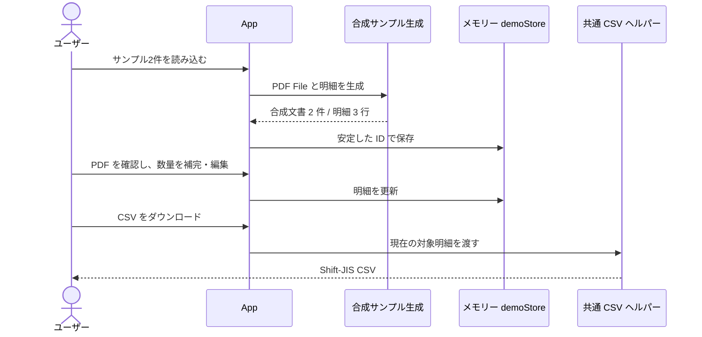
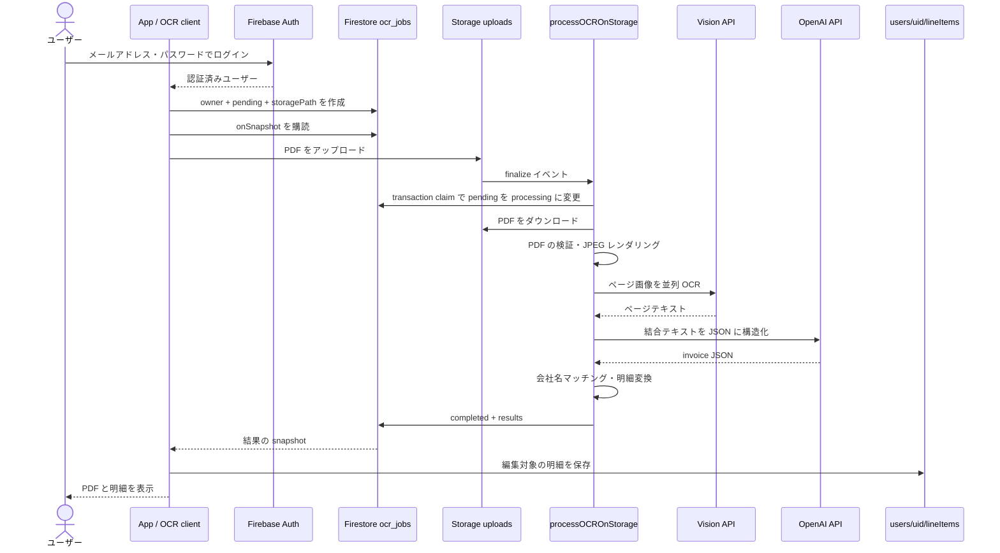

# システム構成

[English](../architecture.md) · [日本語 README](../../README.ja.md)

この文書では、公開用ソースの現在の画面が使用する経路と、データの保存境界を説明する。各フィールドの詳細は[データモデル](data-model.md)、ファイル別の役割は[コードマップ](code-map.md)を参照。

## 1. レイヤーと責務

| レイヤー | 責務 | 直接担当しないもの |
|---|---|---|
| React UI | PDF 一覧、明細編集、原本表示、履歴、ダウンロード | OCR モデル呼び出し・秘密鍵管理 |
| フロントエンドサービス | 実行モードの分岐、所有者の明細 CRUD、ジョブの作成・購読 | Vision・OpenAI サービスの認証情報 |
| Firestore ジョブドキュメント | サーバーの進行状況と結果の受け渡し | その後にユーザーが編集した明細 |
| Storage オブジェクト | アップロードした PDF の保存、処理開始イベント | 明細データベース |
| Cloud Function | 認証・所有者確認、PDF レンダリング、OCR、JSON 構造化、変換 | ブラウザー内の表の編集状態 |
| 共通 CSV ヘルパー | 入力検証、合計と割増、40 列への配置、文字エンコーディング | 伝票確定・会計ソフトへのインポート実行 |

フロントエンド UI は、`App.tsx` が状態を管理する単一画面である。PDF 原本はブラウザーの File をローカルの PDF.js canvas に描画して表示する。前後のページに移動でき、ファイル変更時や画面のクリーンアップ時には読み込み・レンダリング処理を終了する。現在の UI には、別のサーバーレンダリングやページルーティングのレイヤーはない。

## 2. 標準デモの経路

デモは固定の明細と合成テキスト PDF を生成する。数量が空欄の 1 行を原本と照合して入力する確認作業を含む。任意の PDF アップロードを、実際に OCR したかのようには処理しない。`demoStore` はブラウザーメモリー内の Map であり、再読み込み後に復元される永続ストレージではない。

## 3. クラウド OCR の経路

この処理では、PDF を Google Cloud の Storage・Vision に、OCR テキストを OpenAI に送信する。標準デモでは、これらの外部送信は行わない。

## 4. 認証と所有者の境界

- クライアントは `requireCloudUser()` により、デモ・未設定・未ログイン状態でのクラウド実行を防ぐ。
- ジョブドキュメントの作成者は、自分の UID を `userId` に設定する。読み取りはジョブ所有者に限定し、サーバーが管理する状態・結果の変更はクライアントに許可しない。
- アップロードオブジェクトは、`uploads/{jobId}/invoice.pdf` とジョブドキュメントの `storagePath` / `fileName` が一致する必要がある。ファイルがアップロードされたという理由だけで任意のジョブを実行しない。
- サーバーは transaction で `pending` のジョブのみを `processing` に変更する。同じオブジェクトのイベントが再配信されても、すでに processing/completed 状態なら新しい OCR 呼び出しを開始しない。
- 明細の非同期処理では、開始時の認証ユーザーオブジェクトと UID を固定し、アカウント変更時には結果の反映・後続の保存を中止する。編集明細は `users/{uid}/lineItems/{id}` に保存する。フロントエンドのパス構築と Firestore ルールの両方で所有者を区別する。
- 補助 HTTP API は Firebase Bearer ID token を検証する。PDF URL の発行では、ログインの確認に加えて、要求したファイルの所有者も確認する。

これらはソースに実装されたアクセス境界である。本番環境の IAM、デプロイ済みルール、サービスアカウントの権限が一致するかは、別途検証する必要がある。CORS 設定は認証の代わりにはならない。

## 5. 結果と編集データのライフサイクル

| データ | 保存先 | 保持期間・削除方法 |
|---|---|---|
| デモ明細・PDF | ブラウザーメモリー | 再読み込みで消える |
| 現在の画面の文書一覧 | React state | 現在の実行セッション |
| OCR ジョブ状態・元の結果 | `ocr_jobs/{jobId}` | 自動 TTL・クリーンアップ処理なし |
| アップロード PDF | Storage の uploads パス | 明細を削除するだけでは自動削除されない |
| クラウドの編集明細 | `users/{uid}/lineItems/{id}` | 明示的な行・文書削除 |
| 会社名マスター | `companies/{id}` | 運用者が別途管理 |
| 会社マスターのキャッシュ | 関数インスタンスのメモリー | 最大 1 時間を基準に、インスタンスごとに保持 |
| CSV | ユーザーのダウンロードファイル | アプリ外のファイルとして残る |

明細の保存時に古い行を自動削除することはない。保持期間を定める運用方針とオブジェクトのクリーンアップ機能は、このパッケージに完成した形では含まれていない。

## 6. 画面編集と同期

明細は `sourceDocumentId` で所属する文書を、`id` で各行を識別する。メイン画面は複数文書の行をまとめて表示できるが、変更後には文書ごとに振り分け直す。認証変更時には App の世代番号を増やし、前の処理から遅れて届いた状態・結果が新しいアカウントの画面に表示されることを防ぐ。前のアカウントのパスですでに完了した書き込みを取り消す transaction ではない。行の追加・変更・削除をストレージに反映してから画面を同期する。履歴も同じ明細サービスを使用する。

金額フィールドは自動会計計算表ではない。サーバーの初回変換には数量×単価による補正があるが、ユーザーのセル編集時に、関連する全フィールド・税額を再計算する汎用ルールエンジンはない。CSV 出力前に、原本・数量・単価・金額・取引先をあわせて確認する必要がある。

メイン画面の一括 CSV には現在の画面の全明細を渡す。履歴の文書別 CSV には、その文書の明細だけを渡す。同じ共通ヘルパーでも、入力範囲が変わるとデモの割増計算に用いる基準合計が変わる。

## 7. 失敗時の境界

- 複数 PDF は順番に実行する。ある文書のエラーは文書単位で扱い、ほかの文書は処理できるようにする。
- OCR 失敗を金額 0 の正常な明細に置き換えない。エラーを画面に伝え、明細データと区別する。
- クライアントの 5 分 timeout は購読を終了するが、サーバージョブは取り消さない。サーバー関数の最大実行時間は 540 秒である。
- transaction claim 後にサーバーが停止すると、processing のジョブが残ることがある。自動 lease 失効・再試行 queue・管理者向け復旧画面はない。
- 複数行にわたる明細の保存・更新は、伝票全体を 1 つの transaction にまとめない。部分成功に対する補償・復旧は、本番運用前に追加検討が必要である。

## 8. 旧経路と現在の経路

現在の App は、Storage trigger ベースの `ocrServiceAsync` を使用する。`ocrService.ts` の HTTP ベース OCR、fuzzy matching の研究モジュール、quality logging、consistency comparison は参照用として残っている。これらすべてを現在の OCR pipeline の必須工程として説明してはならない。

サーバーの HTTP 関数は、App が使用しているかどうかとは別に export されている。デプロイ時には実際の export 一覧と Hosting rewrite をあわせて確認する必要がある。接続関係は[コードマップ](code-map.md)にまとめた。
