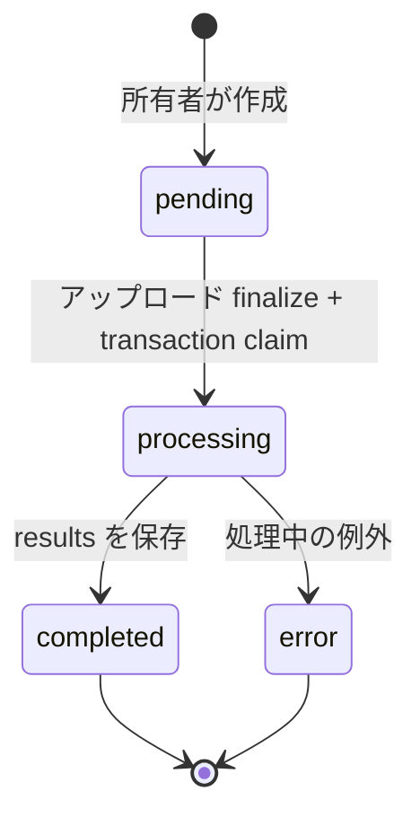

# データモデルと保存契約

[English](../data-model.md) · [日本語 README](../../README.ja.md)

フロントエンドの型は `src/types/index.ts`、サーバーの抽出型は `functions/src/services/gptService.ts`、変換結果は `lineItemConverter.ts` を基準とする。ソースの型と Firestore ルールが検査する範囲は異なるため、両方を読む必要がある。

## 1. 明細 `LineItem`

| フィールド | フロントエンドの型 | 意味と生成経路 |
|---|---|---|
| `id` | string | 行の識別子。クラウドの初回結果は `jobId-index`、手動追加行は別の ID |
| `sourceDocumentId` | string? | 所属する PDF・ジョブの識別子。同じファイル名の再処理も別文書として区別 |
| `仕入日` | string | 請求書・仕入の日付。CSV の D 列に渡す |
| `伝票番号` | string | 画面表示用の伝票番号。サーバーは行 index を伝票番号と推測せず、空値を返す |
| `仕入先コード` | string | 仕入先コード。サーバーでは合成データの lookup を使用 |
| `仕入先名` | string | 仕入先名。名称を正規化したうえで保持 |
| `得意先コード` | string? | 船舶・得意先コード |
| `得意先名` | string? | 船舶・得意先名 |
| `商品コード` | string | サーバーの商品 lookup 結果、またはサンプルコード |
| `商品名` | string | 部品番号を含む商品名 |
| `数量` | number または null | null は不明確で、ユーザーによる確認が必要な数量 |
| `単価` | number | 単価。サーバー抽出値が null なら変換段階で 0 にする |
| `金額` | number | 行の金額。サーバー補正後の値で、null なら 0 |
| `課税区分` | string | 表示用の区分。現在の CSV では、この文字列を直接出力しない |
| `摘要` | string? | ヘッダーの機械型式などの説明 |
| `pdfFileName` | string? | 表示用の元のファイル名。サーバーパス用の安全なファイル名とは区別 |
| `pdfFile` | File? | ブラウザーセッションの原本ファイル。Firestore のシリアライズから除外 |
| `pdfUrl` | string? | 旧データとの互換用。現在のサーバー結果は永続的な公開 URL を生成しない |
| `pdfStoragePath` | string? | バケット内のパス。URL ではなく `uploads/.../...pdf` |
| `createdAt` | any? | Firestore Timestamp またはデモの保存時刻 |

サーバーの `ServerLineItem` は、item の `摘要` または `型式番号` を格納する `備考: string` も返す。このフィールドはフロントエンドの `LineItem` インターフェースには宣言されていない。オブジェクト spread によって保持される場合があるが、正式な編集・CSV 契約のフィールドとして扱ってはならない。

共通 CSV ヘルパーは、`商品コード`、`得意先コード`、`仕入先コード` のフィールドをそのまま使わず、名称ベースの合成 mapping を適用する。そのため、コードフィールドの編集内容が CSV の K/P 列にそのまま反映されると考えない。[CSV 仕様](csv-specification.md)の列ごとの出典が基準となる。

## 2. 合成明細の例

```json
{
  "id": "demo-document-a-0",
  "sourceDocumentId": "demo-document-a",
  "仕入日": "2026-01-15",
  "伝票番号": "DEMO-001",
  "仕入先コード": "201",
  "仕入先名": "サンプル部品株式会社",
  "得意先コード": "101",
  "得意先名": "サンプル一号",
  "商品コード": "D1",
  "商品名": "デモ用フィルター A-100",
  "数量": 2,
  "単価": 1200,
  "金額": 2400,
  "課税区分": "課税10.0%",
  "摘要": "架空データ / 型式 DEMO-A",
  "pdfFileName": "demo-invoice-001.pdf"
}
```

JSON の例では `pdfFile` と Timestamp を省略した。`課税10.0%` という表示文字列があっても、アプリがその行の税金を 10% で計算し、税額を保存しているという意味ではない。

## 3. 画面上の文書 `PDFDocument`

```ts
interface PDFDocument {
  id: string
  file: File
  uploadedAt: Date
  lineItems: LineItem[]
  status: 'uploaded' | 'processing' | 'completed' | 'error'
}
```

この文書型は画面状態のための構造である。オブジェクト全体を Firestore に保存することはない。File は Storage またはデモメモリーに、明細はユーザー配下のコレクションに、OCR 処理状態は job にそれぞれ保存する。履歴画面は、明細の文書識別子から文書一覧を復元する。

## 4. OCR ジョブ `ocr_jobs/{jobId}`

クライアントが作成できるフィールドは、次の 5 つだけである。

| フィールド | 値・条件 |
|---|---|
| `status` | 厳密に `pending` |
| `fileName` | サーバー用の安全な PDF ファイル名 |
| `storagePath` | 厳密に `uploads/{jobId}/{fileName}` |
| `userId` | 現在認証されているユーザーの UID |
| `createdAt` | `serverTimestamp()`。ルールで request time との一致を確認 |

サーバーが追加するフィールド:

| フィールド | 意味 |
|---|---|
| `status` | `processing`, `completed`, `error` |
| `message` | ダウンロード・変換・OCR・構造化などの進行段階 |
| `updatedAt` | サーバー更新時刻 |
| `objectGeneration` | claim した Storage オブジェクトの世代。ダウンロードにも同じ generation を使う |
| `results` | 完了時の `ServerLineItem[]` |
| `error` | 失敗時にユーザーへ渡す、詳細を一般化したエラーメッセージ |



クライアントには job の update/delete 権限がない。エラー後の新しいアップロードは、新しい job として処理する。pending や processing が長く続く場合に復旧するための状態遷移・lease・TTL は実装していない。

ファイル名には、ASCII 英数字で始まり、英数字・ピリオド・アンダースコア・ハイフンが続き、PDF 拡張子で終わるという制限がある。連続する `..` は禁止する。クライアントによるパス用名称の生成とルールによる検証は一致する必要があり、現在のクライアントではオブジェクト名を `invoice.pdf` に固定している。元の日本語ファイル名は、明細表示用 metadata として別に保持する。

## 5. LLM の中間構造 `StructuredInvoice`

```ts
interface StructuredInvoice {
  仕入先名: string
  仕入先コード?: string
  仕入日: string
  機械型式?: string
  document_subtotal?: number | null
  ships: Array<{
    ship_name: string | null
    items: Array<{
      商品名: string
      数量: number | null
      単価: number | null
      金額: number | null
      摘要?: string | null
      型式番号?: string | null
    }>
  }>
}
```

`validateStructuredInvoice` は、必須ヘッダー文字列、船舶配列、item の商品名、数値/null、任意の説明文字列を検査し、全 item 数を 1,000 以下に制限する。JSON mode を使用するが、API に厳密な JSON schema を送る Structured Outputs の構成ではない。

検証関数はすべての業務ルールを確認するわけではない。日付が暦上有効か、単価・数量が原票と合うか、supplier code が登録済みか、文書合計と明細合計が一致するかまでは保証しない。`document_subtotal` は抽出型に含まれるが、後続の合計検証には使用されない。

## 6. 永続化とシリアライズ

`firestoreService` は、ログイン UID 配下の明細のみを読み書きする。新規保存では渡された ID を保持し、ID がない場合に UUID を生成する。`id` はドキュメント ID なので本文のシリアライズから取り除き、`pdfFile` と undefined フィールドも取り除く。`createdAt`、`updatedAt` はクライアントの `Timestamp.now()` に基づく。

現在の明細ルールはユーザーの所有権を制限するが、明細フィールドごとの schema や財務計算をルールで検証しない。クライアントが変更できるデータを、サーバーが確定した会計帳簿のように扱ってはならない。

保存時に古い行を自動削除しない。複数行の保存は順次リクエストであり、一括 transaction ではない。同じ PDF を新しい job で再送信すると、別文書として保存される場合がある。ファイル内容の hash による重複検出機能はない。

## 7. 会社マスターとコード一覧

`companies/{id}` ドキュメントの名称マッチング用フィールド:

```json
{
  "name": "サンプル部品株式会社",
  "variants": ["サンプル部品", "Sample Parts Co."]
}
```

これは、Admin SDK を使う別の運用手順で投入する合成例である。通常のクライアントには読み取りだけを許可する。取得結果は関数インスタンスごとのメモリーに 1 時間保持する。このマスターは仕入先名の正規化用であり、サーバーの合成コード lookup やフロントエンドの CSV mapping を自動的に置き換えるものではない。

参照用の `public/code-lists/` CSV は、旧 `codeListService` が読み込む。仕入先・得意先 CSV は先頭 2 行を読み飛ばし、2 列目の code、3 列目の name、5 列目の abbreviation を使用する。商品 CSV は先頭 5 行を読み飛ばし、2 列目の code、3 列目の name を使用する。マスターのインポート UI や実取引のマスターは含まれない。
